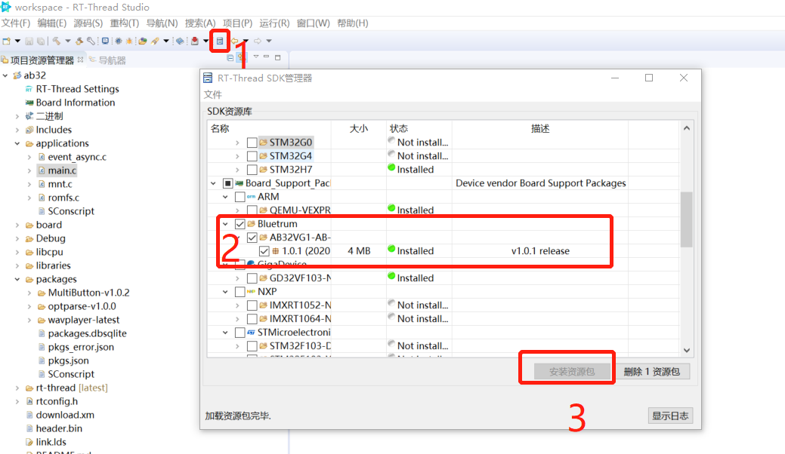
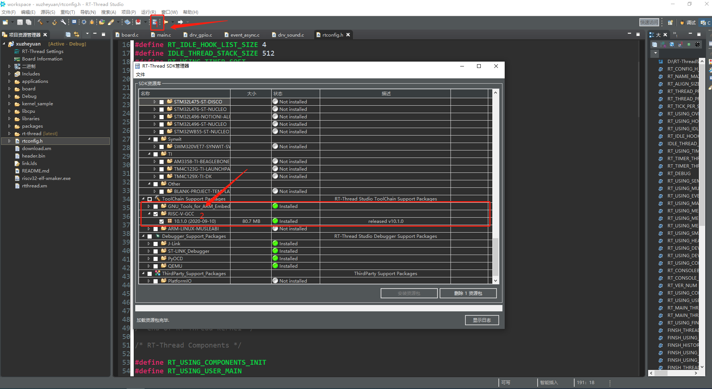
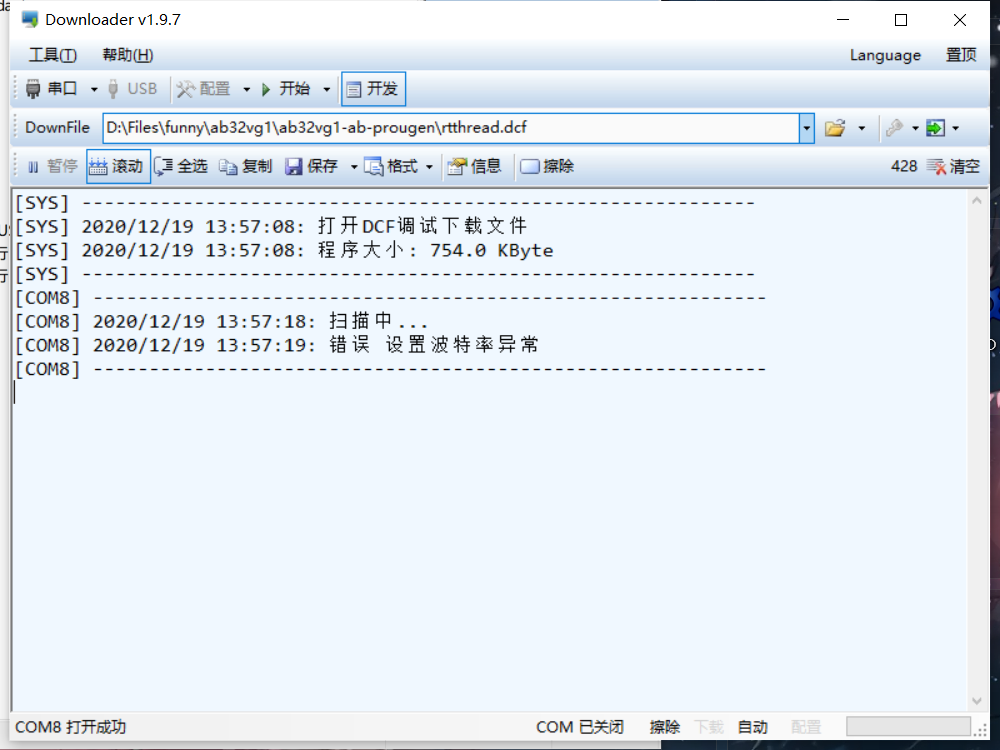
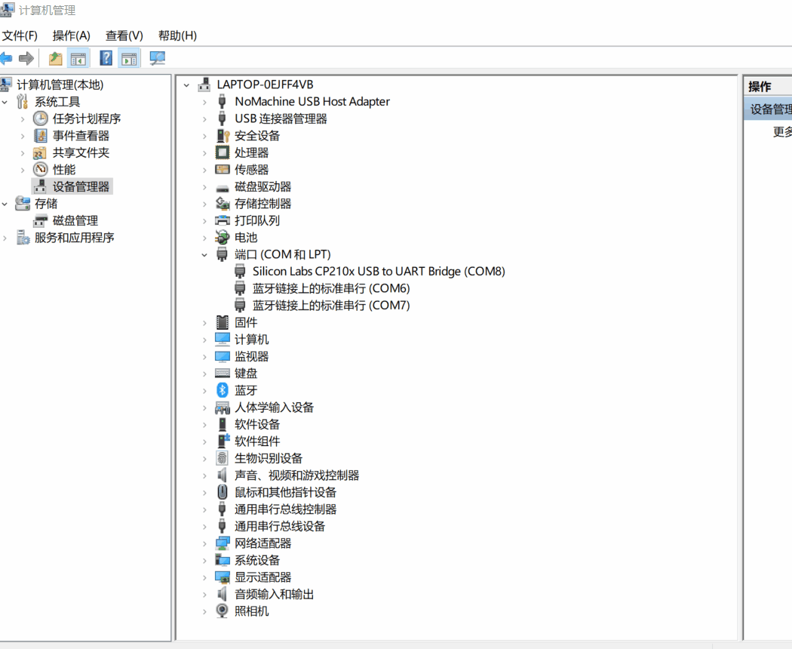
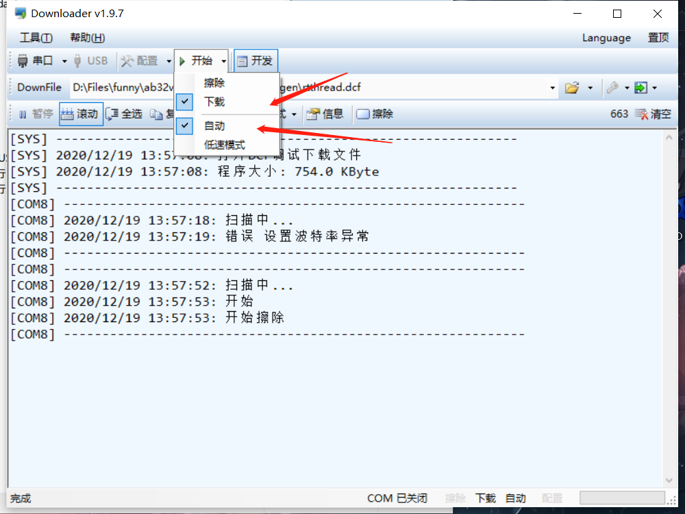

Experiment preparation
========================

实验前需要下载

+ `rt-thread studio 安装包 <https://www.rt-thread.org/page/studio.html>`_ 
+ `Downloader(下载软件) <https://gitee.com/bluetrum/Downloader/blob/main/Downloader_v1.9.7.zip>`_ 
+ `配套的 USB 转串口驱动 <https://gitee.com/bluetrum/Downloader/blob/main/CP210x_Windows_Drivers.rar>`_

rt-thread studio 安装
--------------------------

首先需要确保已经安装 rt-thread studio 

在工具栏找到 SDK 管理器，点击后在弹出窗口，**Board_Support_Packages** -> **Bluetrum_AB32VG1-ab-prougen** ,勾选，安装资源包，至此可以在rt-thread studio基于AB32VG1做开发了

还需要在 SDK 管理器中安装 riscv 的工具链，否则无法编译

Downloader 安装
--------------------

我们是使用 Downloader 进行程序的固件下载的，编译出来的固件后缀为.dcf,该文件位于工程Debug目录下。 Downloader 软件需要安装自己的 USB 转串口驱动，如果驱动不匹配，会报下面的这个错误，这时需要安装配套的 USB 转串口驱动 。

安装完驱动后，切换到我们的驱动，具体操作如下图

如何希望能够编译后自动下载，需要在 **Downloader** 中的下载的下拉窗中选择 **自动**

实验操作
----------------------------------------

+ :ref:`从内部Flash读取WAV音频播放`   