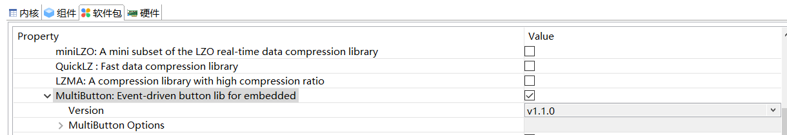

从内部Flash读取WAV音频播放
===============================

前言
------

开始实验前，请先查看 :ref:`Experiment preparation`

最终的工程可以在这里下载 :download:`wav_player_rom.zip <others/wav_player_rom.zip>`

软件包安装
-----------

本次实验实现音乐播放功能，单击按键进行音乐切换。需要安装的软件包有 wavplayer/optparse/multibutton 三个软件包。其中 optparse 在 wavplayer 勾选后，自动选择。

进入软件包选择界面.

也可以通过`更多配置`查看所有软件包来选择个软件包：

wavplayer 软件包安装
---------------------

multibutton 软件包安装
----------------------

保存,下载软件包到工程
----------------------
软件包选择完成后，点击 保存 按钮，将配置保存并应用到工程中。保存的时候会弹出进度提示框，提示保存进度，会自动下载到 package 目录下。

demo编写
---------

安装完 wavplayer/optparse/multibutton 三个软件包之后，就完成此次试验所需要的依赖的软件包。接下来开始编写demo。

首先需要下载 romfs.c（本文件包含了两个音频文件用于demo播放） 替换 applications 下原有的 romfs.c 

:download:`romfs.c <others/romfs.c>`

检查一下 `mnt.c` 这个文件里的挂载信息，看看是否挂载的是 romfs，不是的话进行下面的修改

.. code-block:: c
    :linenos:

    #include <dfs_fs.h>
    #include "dfs_romfs.h"

    int mnt_init(void)
    {
        if (dfs_mount(RT_NULL, "/", "rom", 0, &(romfs_root)) == 0)
        {
            rt_kprintf("ROM file system initializated!\n");
        }
        else
        {
            rt_kprintf("ROM file system initializate failed!\n");
        }

        return 0;
    }
    INIT_ENV_EXPORT(mnt_init);

然后在 applications 下新建 event_async.c 文件，复制以下代码

.. code-block:: c
    :linenos:

    #include <rtthread.h> 
    #include <rtdevice.h>
    #include "board.h"
    #include <multi_button.h>
    #include "wavplayer.h"

    #define BUTTON_PIN_0 rt_pin_get("PF.0")
    #define BUTTON_PIN_1 rt_pin_get("PF.1")

    #define NUM_OF_SONGS    (2u)

    static struct button btn_0;
    static struct button btn_1;

    static uint32_t cnt_0 = 0;
    static uint32_t cnt_1 = 0;

    static char *table[2] =
    {
        "wav_1.wav",
        "wav_2.wav",
    };

    void saia_channels_set(uint8_t channels);
    void saia_volume_set(rt_uint8_t volume);
    uint8_t saia_volume_get(void);

    static uint8_t button_read_pin_0(void) 
    {
        return rt_pin_read(BUTTON_PIN_0);
    }

    static uint8_t button_read_pin_1(void) 
    {
        return rt_pin_read(BUTTON_PIN_1);
    }

    static void button_0_callback(void *btn)
    {
        uint32_t btn_event_val;

        btn_event_val = get_button_event((struct button *)btn);

        switch(btn_event_val)
        {
        case SINGLE_CLICK:
            if (cnt_0 == 1) {
                saia_volume_set(30);
            }else if (cnt_0 == 2) {
                saia_volume_set(50);
            }else {
                saia_volume_set(100);
                cnt_0 = 0;
            }
            cnt_0++;
            rt_kprintf("vol=%d\n", saia_volume_get());
            rt_kprintf("button 0 single click\n");
        break; 

        case DOUBLE_CLICK:
            if (cnt_0 == 1) {
                saia_channels_set(1);
            }else {
                saia_channels_set(2);
                cnt_0 = 0;
            }
            cnt_0++;
            rt_kprintf("button 0 double click\n");
        break; 

        case LONG_PRESS_START:
            rt_kprintf("button 0 long press start\n");
        break; 

        case LONG_PRESS_HOLD:
            rt_kprintf("button 0 long press hold\n");
        break; 
        }
    }

    static void button_1_callback(void *btn)
    {
        uint32_t btn_event_val;
        
        btn_event_val = get_button_event((struct button *)btn);
        
        switch(btn_event_val)
        {
        case SINGLE_CLICK:
            wavplayer_play(table[(cnt_1++) % NUM_OF_SONGS]);
            rt_kprintf("button 1 single click\n");
        break; 

        case DOUBLE_CLICK:
            rt_kprintf("button 1 double click\n");
        break; 

        case LONG_PRESS_START:
            rt_kprintf("button 1 long press start\n");
        break; 

        case LONG_PRESS_HOLD:
            rt_kprintf("button 1 long press hold\n");
        break; 
        }
    }

    static void btn_thread_entry(void* p)
    {
        while(1)
        {
            /* 5ms */
            rt_thread_delay(RT_TICK_PER_SECOND/200);
            button_ticks(); 
        }
    }

    static int multi_button_test(void)
    {
        rt_thread_t thread = RT_NULL;

        /* Create background ticks thread */
        thread = rt_thread_create("btn", btn_thread_entry, RT_NULL, 1024, 10, 10);
        if(thread == RT_NULL)
        {
            return RT_ERROR; 
        }
        rt_thread_startup(thread);

        /* low level drive */
        rt_pin_mode  (BUTTON_PIN_0, PIN_MODE_INPUT_PULLUP); 
        button_init  (&btn_0, button_read_pin_0, PIN_LOW);
        button_attach(&btn_0, SINGLE_CLICK,     button_0_callback);
        button_attach(&btn_0, DOUBLE_CLICK,     button_0_callback);
        button_attach(&btn_0, LONG_PRESS_START, button_0_callback);
        button_attach(&btn_0, LONG_PRESS_HOLD,  button_0_callback);
        button_start (&btn_0);

        rt_pin_mode  (BUTTON_PIN_1, PIN_MODE_INPUT_PULLUP); 
        button_init  (&btn_1, button_read_pin_1, PIN_LOW);
        button_attach(&btn_1, SINGLE_CLICK,     button_1_callback);
        button_attach(&btn_1, DOUBLE_CLICK,     button_1_callback);
        button_attach(&btn_1, LONG_PRESS_START, button_1_callback);
        button_attach(&btn_1, LONG_PRESS_HOLD,  button_1_callback);
        button_start (&btn_1);

        return RT_EOK; 
    }
    INIT_APP_EXPORT(multi_button_test); 

程序下载
---------

demo编写完成后，单击编译按钮开始编译，编译成功后下载编译后生成的 `.dcf` 固件到芯片；

双击打开Downloader v1.9.7。

下载成功后会在串口界面打印"Hello World"， 并会有led灯闪烁

此时按下按键S2，会播放第一首音乐，再次按下，播放下一首音乐，依次循环。

